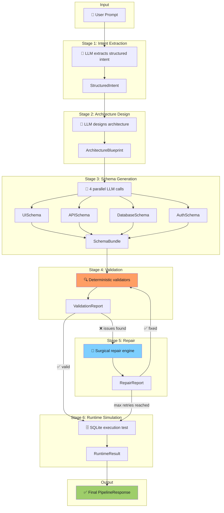

<div align="center">

# ⚙️ AI Application Compiler

**Convert natural language software requirements into validated, executable application configurations.**

[](https://www.python.org/downloads/)
[](https://docs.pydantic.dev/)
[](https://fastapi.tiangolo.com/)
[](LICENSE)
[]()

<br />

*A multi-stage AI compiler pipeline that transforms a single sentence into a full-stack application schema — complete with UI, API, database, and auth layers — all validated and execution-tested against SQLite.*

</div>

---

## 📋 Table of Contents

- [Problem Statement](#-problem-statement)
- [How It Works](#-how-it-works)
- [System Architecture](#-system-architecture)
- [Pipeline Flow](#-pipeline-flow)
- [Folder Structure](#-folder-structure)
- [Data Contracts](#-data-contracts)
- [Validation & Repair Strategy](#-validation--repair-strategy)
- [Runtime Simulation](#-runtime-simulation)
- [Current Progress](#-current-progress)
- [Roadmap](#-roadmap)
- [Local Setup](#-local-setup)
- [Example Usage](#-example-usage)
- [Tech Stack](#-tech-stack)
- [License](#-license)

---

## 🔍 Problem Statement

Current AI code generators suffer from three critical problems:

| Problem | What Happens |
|---------|-------------|
| **One-shot generation** | A single LLM call tries to produce everything — leading to inconsistent, unpredictable outputs |
| **No structural validation** | Generated schemas are never checked for missing fields, broken references, or logical errors |
| **No execution verification** | Nobody tests whether the generated database schema can even create tables |

**AI Application Compiler** solves this by treating prompt-to-config as a **compilation problem** — with distinct stages for parsing, code generation, validation, error repair, and execution testing — just like a real compiler.

---

## 💡 How It Works

```
"Build a task management app with teams, deadlines, and role-based access"
```

↓ **Stage 1** — Extracts structured intent (app type, features, constraints)
↓ **Stage 2** — Designs architecture (entities, roles, pages, flows)
↓ **Stage 3** — Generates 4 schemas (UI, API, Database, Auth)
↓ **Stage 4** — Validates structure, references, and logic (deterministic, no LLM)
↓ **Stage 5** — Repairs only failing sections (surgical, not regeneration)
↓ **Stage 6** — Executes against SQLite to prove the schema works

```json
{
  "status": "success",
  "final_config": {
    "ui":       { "pages": [...], "components": [...] },
    "api":      { "endpoints": [...] },
    "database": { "tables": [...], "indexes": [...] },
    "auth":     { "strategy": "jwt", "roles": [...], "route_guards": [...] }
  }
}
```

> **Key principle:** No single LLM call produces the final output. Each stage has a typed input, a typed output, and a clear responsibility.

---

## 🏗️ System Architecture



---

## 📂 Folder Structure

```
ai-app-compiler/
│
├── backend/
│   ├── __init__.py
│   │
│   ├── schemas/                        # ✅ COMPLETE — All data contracts
│   │   ├── __init__.py                 #   Public re-exports (56 symbols)
│   │   ├── enums.py                    #   26 enum types
│   │   ├── common.py                   #   StrictBaseModel base class
│   │   ├── intent.py                   #   S1: StructuredIntent
│   │   ├── architecture.py             #   S2: ArchitectureBlueprint
│   │   ├── schema_bundle.py            #   S3: UISchema, APISchema, DatabaseSchema, AuthSchema, SchemaBundle
│   │   ├── validation.py               #   S4: ValidationIssue, ValidationReport
│   │   ├── repair.py                   #   S5: RepairAction, RepairReport
│   │   ├── runtime.py                  #   S6: RuntimeResult
│   │   └── pipeline.py                 #   PipelineRequest, PipelineResponse
│   │
│   ├── tests/
│   │   ├── __init__.py
│   │   └── verify_contracts.py         # ✅ Round-trip verification (8/8 pass)
│   │
│   ├── pipeline/                       # 🔲 PLANNED
│   │   ├── orchestrator.py             #   Sequential stage execution
│   │   ├── context.py                  #   Shared pipeline state
│   │   └── errors.py                   #   Pipeline error types
│   │
│   ├── stages/                         # 🔲 PLANNED
│   │   ├── s1_intent/                  #   Prompt → StructuredIntent
│   │   ├── s2_architecture/            #   Intent → ArchitectureBlueprint
│   │   ├── s3_schema/                  #   Architecture → SchemaBundle
│   │   ├── s4_validation/              #   SchemaBundle → ValidationReport
│   │   ├── s5_repair/                  #   SchemaBundle + Report → RepairReport
│   │   └── s6_runtime/                 #   SchemaBundle → RuntimeResult (SQLite)
│   │
│   ├── llm/                            # 🔲 PLANNED
│   │   ├── client.py                   #   Gemini API wrapper
│   │   ├── parser.py                   #   LLM JSON response parser
│   │   └── prompt_utils.py             #   Prompt construction helpers
│   │
│   ├── api/                            # 🔲 PLANNED
│   │   └── routes/                     #   FastAPI endpoints
│   │
│   └── db/                             # 🔲 PLANNED
│       └── sqlite_manager.py           #   In-memory SQLite lifecycle
│
├── frontend/                           # 🔲 PLANNED — React/Next.js UI
│
├── .env.example                        # ✅ Environment variable template
├── .gitignore                          # ✅ Python/FastAPI gitignore
├── LICENSE                             # ✅ MIT License
├── pyproject.toml                      # ✅ Project config (Python 3.11+)
└── README.md                           # ✅ This file
```

---

## 📜 Data Contracts

All inter-stage communication uses **strictly typed Pydantic v2 models**. No free-form text passes between stages.

| # | Contract | Stage | Purpose |
|---|----------|-------|---------|
| 1 | `StructuredIntent` | S1 → S2 | App name, type, features, constraints |
| 2 | `ArchitectureBlueprint` | S2 → S3 | Entities, roles, pages, features, flows |
| 3 | `UISchema` | S3 | Page layouts, components, form fields |
| 4 | `APISchema` | S3 | REST endpoints, params, request/response shapes |
| 5 | `DatabaseSchema` | S3 | SQLite tables, columns, indexes, foreign keys |
| 6 | `AuthSchema` | S3 | JWT config, roles, permissions, route guards |
| 7 | `SchemaBundle` | S3 → S4/S5/S6 | Composite of UI + API + DB + Auth |
| 8 | `ValidationIssue` | S4 | Single issue with location, severity, suggestion |
| 9 | `ValidationReport` | S4 → S5 | Aggregated validation results |
| 10 | `RepairAction` | S5 | Single repair with before/after state |
| 11 | `RepairReport` | S5 → S4/S6 | Repair results + patched schema |
| 12 | `RuntimeResult` | S6 | SQLite execution results |
| 13 | `PipelineRequest` | API Input | User prompt + pipeline options |
| 14 | `PipelineResponse` | API Output | Per-stage results + final config |

### Design Principles

- **`extra="forbid"`** — All models reject unexpected fields, preventing LLM output drift
- **26 enums** — Every categorical field is backed by a `str, Enum` for type safety
- **Cross-layer references** — Entity names from `ArchitectureBlueprint` are the canonical identifiers referenced by all 4 schema layers
- **Self-validating** — `ValidationReport` uses `@model_validator` to ensure issue counts match

---

## 🔍 Validation & Repair Strategy

### Validation (Stage 4) — Fully Deterministic

The validation engine runs **three categories** of checks with **zero LLM calls**:

| Category | What It Checks | Example |
|----------|---------------|---------|
| **Structural** | JSON shape, required fields, type correctness | Missing `primary_key` column in a table |
| **Referential** | Cross-layer reference integrity | API endpoint references entity that doesn't exist |
| **Logical** | Business logic consistency | UI form submits to a GET endpoint |

### Repair (Stage 5) — Surgical, Not Regenerative

The repair engine **never regenerates the full schema**. It fixes only what's broken:

| Strategy | When Used | Example |
|----------|-----------|---------|
| **Deterministic** | Missing defaults, type coercion, simple additions | Add missing `created_at` column |
| **LLM-Assisted** | Semantic ambiguity, context-dependent fixes | Restructure endpoint when entity changes |

The repair loop runs a **maximum of 3 iterations** (configurable) before producing a best-effort output with remaining issues flagged.

---

## 🗄️ Runtime Simulation

Stage 6 proves the generated schema is **actually executable**:

1. **Converts** `DatabaseSchema` → SQL DDL statements
2. **Creates** an in-memory SQLite database
3. **Executes** `CREATE TABLE` for every table
4. **Inserts** seed data (default roles, etc.)
5. **Runs** verification queries (table counts, foreign key checks, constraint validation)

If any step fails, the `RuntimeResult` captures the exact SQL and error message.

---

## ✅ Current Progress

| Component | Status | Details |
|-----------|--------|---------|
| System Architecture | ✅ Complete | 6-stage pipeline design |
| Folder Structure | ✅ Complete | Full backend + planned frontend |
| Data Contracts | ✅ Complete | 14 Pydantic models, 26 enums, ~30 sub-models |
| Round-trip Verification | ✅ Complete | 8/8 test groups pass |
| Repository Setup | ✅ Complete | README, .gitignore, LICENSE, pyproject.toml |
| Pipeline Orchestrator | 🔲 Planned | Stage sequencing, context, error handling |
| LLM Client (Gemini) | 🔲 Planned | API wrapper with retry, rate limiting |
| Stage Implementations | 🔲 Planned | S1–S6 business logic |
| FastAPI Endpoints | 🔲 Planned | POST /compile, GET /health |
| Frontend UI | 🔲 Planned | React/Next.js interface |

---

## 🗺️ Roadmap

### Phase 1 — Foundation ✅
- [x] System architecture design
- [x] Folder structure
- [x] 14 Pydantic data contracts with strict typing
- [x] 26 enum types
- [x] Round-trip verification tests
- [x] GitHub-ready repository

### Phase 2 — Core Pipeline 🔲
- [ ] Gemini LLM client with retry and rate limiting
- [ ] Pipeline orchestrator with context passing
- [ ] Stage 1: Intent Extraction (prompt → `StructuredIntent`)
- [ ] Stage 2: Architecture Design (intent → `ArchitectureBlueprint`)
- [ ] Stage 3: Schema Generation (4 parallel sub-generators)

### Phase 3 — Validation & Repair 🔲
- [ ] Stage 4: Structural, referential, and logical validators
- [ ] Stage 5: Deterministic + LLM-assisted repair engine
- [ ] Validation ↔ Repair loop with configurable max iterations

### Phase 4 — Runtime & API 🔲
- [ ] Stage 6: SQLite runtime simulation
- [ ] FastAPI endpoints (POST /compile, stages, health)
- [ ] Error handling middleware
- [ ] API documentation (OpenAPI/Swagger)

### Phase 5 — Frontend & Polish 🔲
- [ ] React/Next.js frontend
- [ ] Real-time pipeline progress (SSE)
- [ ] Configuration presets
- [ ] Export to downloadable project scaffolds

---

## 🚀 Local Setup

### Prerequisites

- **Python 3.11+** — [Download](https://www.python.org/downloads/)
- **Gemini API Key** — [Get one free](https://aistudio.google.com/apikey)

### Installation

```bash
# Clone the repository
git clone https://github.com/YOUR_USERNAME/ai-app-compiler.git
cd ai-app-compiler

# Create virtual environment
python -m venv .venv

# Activate (Windows)
.venv\Scripts\activate

# Activate (macOS/Linux)
source .venv/bin/activate

# Install dependencies
pip install -e ".[dev]"

# Configure environment
cp .env.example .env
# Edit .env and add your GEMINI_API_KEY
```

### Verify Installation

```bash
# Run contract verification tests
python -m backend.tests.verify_contracts
```

Expected output:

```
============================================================
Contract Round-Trip Verification
============================================================
  PASS  StructuredIntent
  PASS  ArchitectureBlueprint
  PASS  SchemaBundle
  PASS  ValidationReport
  PASS  RepairReport
  PASS  RuntimeResult
  PASS  PipelineRequest
  PASS  PipelineResponse
============================================================
Results: 8 passed, 0 failed
============================================================
```

---

## 💬 Example Usage

> ⚠️ **Pipeline stages are not yet implemented.** The examples below show the **intended API** once Phases 2–4 are complete.

### API Request

```bash
curl -X POST http://localhost:8000/compile \
  -H "Content-Type: application/json" \
  -d '{
    "prompt": "Build a task management app with team collaboration, deadlines, and role-based access",
    "options": {
      "max_repair_iterations": 3,
      "include_seed_data": true
    }
  }'
```

### Python Client

```python
import httpx

response = httpx.post("http://localhost:8000/compile", json={
    "prompt": "Build a project tracker with Kanban boards, sprint planning, and team dashboards",
    "options": {"max_repair_iterations": 3}
})

result = response.json()
print(f"Status: {result['status']}")
print(f"Tables: {len(result['final_config']['database']['tables'])}")
print(f"Endpoints: {len(result['final_config']['api']['endpoints'])}")
print(f"Pages: {len(result['final_config']['ui']['pages'])}")
```

### Data Contract Usage (Available Now)

```python
from backend.schemas import StructuredIntent, SchemaBundle, PipelineRequest

# Validate a pipeline request
request = PipelineRequest(
    prompt="Build an inventory management system with barcode scanning and low-stock alerts",
    options={"max_repair_iterations": 3}
)
print(request.model_dump_json(indent=2))

# Create and validate a structured intent
intent = StructuredIntent(
    app_name="InvenTrack",
    app_type="web_application",
    description="Inventory management system with barcode scanning and automated low-stock alerts",
    target_users=["warehouse_manager", "inventory_clerk", "admin"],
    core_features=[
        {"name": "barcode_scanning", "description": "Scan barcodes to add/lookup items", "priority": "critical"},
        {"name": "stock_alerts", "description": "Automated alerts when stock falls below threshold", "priority": "high"},
    ],
)
print(intent.model_dump_json(indent=2))
```

---

## 🛠️ Tech Stack

| Layer | Technology | Purpose |
|-------|-----------|---------|
| **Language** | Python 3.11+ | Type hints, async/await |
| **Framework** | FastAPI | Async REST API |
| **Validation** | Pydantic v2 | Strict data contracts |
| **Database** | SQLite (in-memory) | Runtime simulation |
| **LLM** | Google Gemini | Intent extraction, schema generation |
| **Testing** | pytest | Unit & integration tests |
| **Linting** | Ruff | Fast Python linter |

---

## 📄 License

This project is licensed under the [MIT License](LICENSE).

---

<div align="center">

**Built with 🧠 and ⚙️ by [Aditya Mishra](https://github.com/YOUR_USERNAME)**

*If you find this project interesting, consider giving it a ⭐*

</div>
